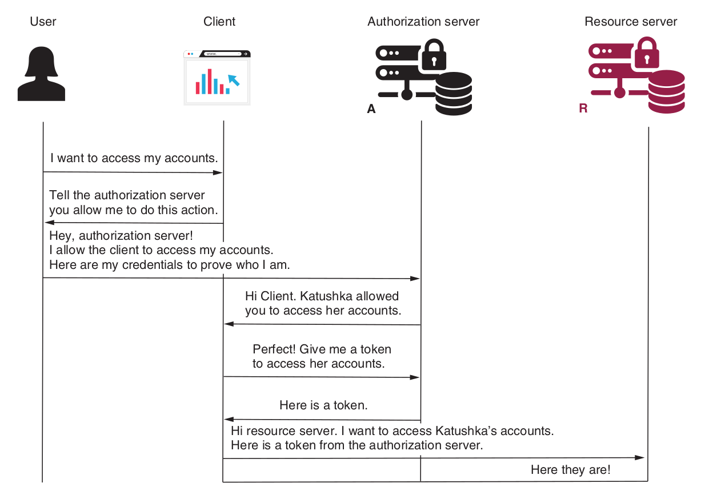

#### Authorization Code Grant Type
The Authorization Code Grant Type is probably the most common of the OAuth 2.0 grant types that you’ll encounter.

**----------------------------------------------------->   Step 1    <-----------------------------------------------------------**

Technically, when the client redirects the user to the authorization server, the client calls the authorization endpoint with the following details in the request query..
- **response_type:** with the value *code* , which tells the authorization server that the client expects a code. The client needs the code to obtain an access token.
- **client_id:** with the value of the *client ID*, which identifies the application itself.
- **redirect_uri:** which tells the authorization server where to redirect the user after successful authentication. Sometimes the authorization server already knows a default redirect URI for each client. In such cases, the client doesn’t need to send the redirect URI
- **scope:** I is s one or more space-separated strings indicating which permissions the application is requesting
- **state:** The application generates a random string and includes it in the request. It should then check that the same value is returned after the user authorizes the app. This is used to prevent CSRF attacks.

After successful authentication, the authorization server calls back the client on the redirect URI and provides a code and the state value. The client checks that the state value is the same as the one it sent in the request to confirm that it was not someone else attempting to call the redirect URI.

**----------------------------------------------------->   Step 2    <-----------------------------------------------------------**

The resulting code is the client’s proof that the user authenticated. Now the client calls the authorization server with the
code to get the token. *So why didn’t the authorization server directly return the second token (access
token)?*

OAuth 2 defines a flow called the **implicit grant type** where the authorization server directly returns an access token. This implicit grant type is not recommended, and most authorization servers today don’t allow it. The simple fact that the authorization server would call the redirect URI directly with an access token without making sure that it was indeed the right client receiving that token makes the flow less secure. By sending an authorization code first, the client has to prove again who they are by using their credentials to obtain an access token. The client makes a final call to get an access token and sends
- The authorization code, which proves the user authorized them
- Their credentials, which proves they really are the same client and not someone else who intercepted the authorization codes

In this step 2, technically, the client now makes a request to the authorization server. This request contains the following details:
**code :** which is the authorization code received in step 1. This proves that the user authenticated.
**client_id and client_secret :** the client’s credentials.
**redirect_uri :** which is the same one used in step 1 for validation.
**grant_type :** with the value authorization_code , which identifies the kind of flow used. A server might support multiple flows, so it’s essential always to specify which is the current executed authentication flow.

As a response, the server sends back an **access_token** . This token is a value that the client can use to call resources exposed by the resource server.

**----------------------------------------------------->   Step 3    <-----------------------------------------------------------**

After successfully obtaining the access token from the authorization server, the client can now call for the protected resource. The client uses an access token in the authorization request header when calling an endpoint of the resource server.
