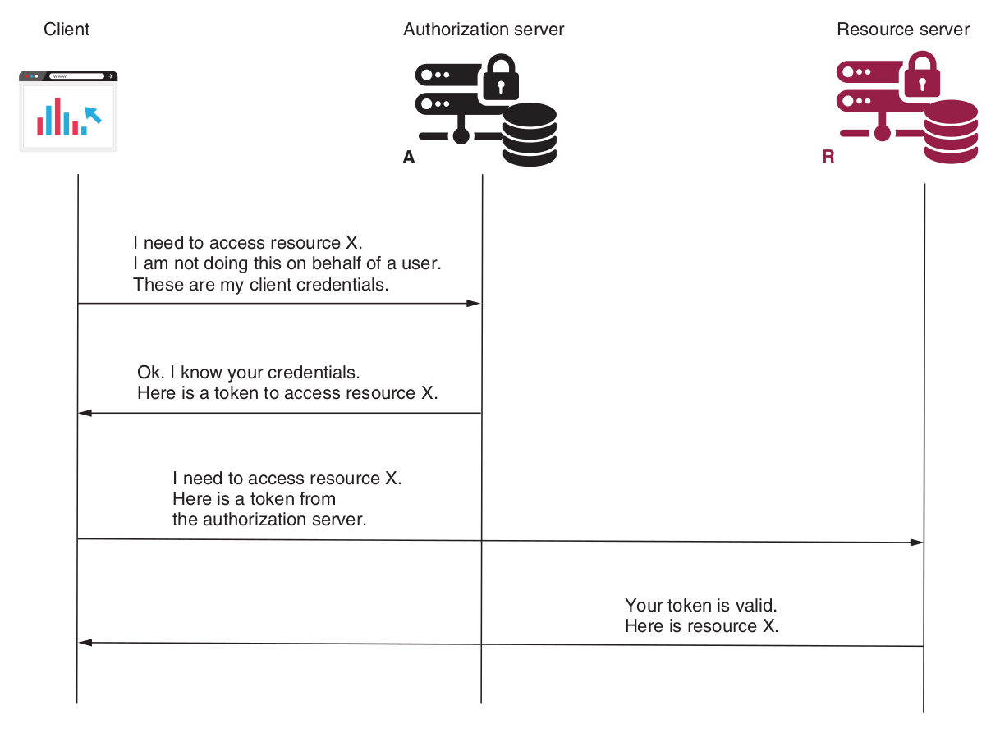

#### Client Credentials Grant Type
This grant type is used when no user is involved; that is, when implementing authentication between two applications.

**----------------------------------------------------->   Step 1    <-----------------------------------------------------------**

To obtain an access token, the client sends a request to the authorization server with the following details:
- **grant_type :** with the value **client_credentials**
- **client_id and client_secret :**  which represent the client credentials
- **scope :** which represents the granted authorities

In response, the client receives an access token. The client can now use the access token to call the endpoints of the resource server.

**----------------------------------------------------->   Step 2    <-----------------------------------------------------------**

Once the client has an access token, it uses that token to call the endpoints on the resource server, which is exactly like the authorization code grant type and the pass- word grant type. The client adds the access token to the requests in the authorization
request header.
