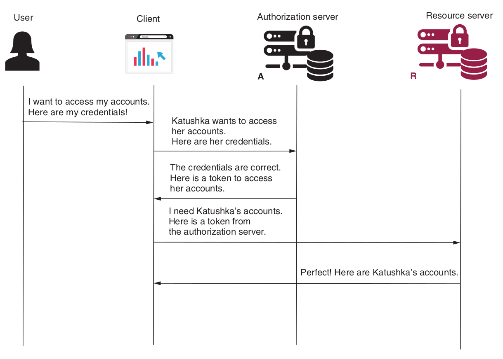

#### Password grant type 
This grant type is also known as the **resource owner credentials grant type**. Applications using this flow assume that the client collects the user credentials and uses these to authenticate and obtain an access token from the authorization server.

**----------------------------------------------------->   Step 1    <-----------------------------------------------------------**

The flow is much simpler with the **password grant type**. The client collects the user credentials and calls the authorization server to obtain an access token. When requesting the access token, the client also sends the following details in the request..
- **grant_type** with the value **password**
- **client_id and client_secret :** which are the credentials used by the client to authenticate itself.
- **scope :** which you can understand as the granted authorities.
- **username and password :**  which are the user credentials. These are sent in plain text as values of the request header.

The client receives back an access token in the response. The client can now use the access token to call the endpoints of the resource server.

**----------------------------------------------------->   Step 2    <-----------------------------------------------------------**

Once the client has an access token, it uses the token to call the endpoints on the resource server, which is exactly like the authorization code grant type. The client adds the access token to the requests in the authorization request header.
