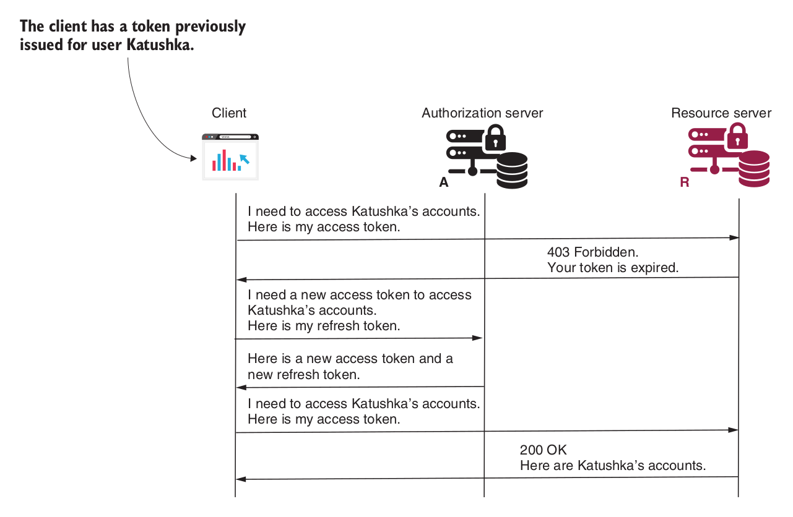

#### Referesh Token Grant Type

OAuth 2 doesn’t assume a specific implementation for tokens. It’s not mandatory you can create tokens with an infinite lifespan but, in general, you should make these as short lived as possible. The refresh tokens represent an alternative to using credentials for obtaining a new access token.

*Let’s look at how to use a refresh token. Where do you get a refresh token from?* 
The authorization server returns a **refresh token** together with an **access token** when using a flow like the **authorization code** or **password grant types**. With the **client credentials grant**, there’s no refresh token because this flow doesn’t need user credentials. Once the client has a refresh token, the client should issue a request with the following details when the access token expires..
- **grant_type :** with value **refresh_token**
- **refresh_token :** with the value of the refresh token.
- **client_id and client_secret :** with the client credentials.
- **scope :**  which defines the same granted authorities or less. If more granted authorities need to be authorized, a reauthentication is needed.

In response to this request, the authorization server issues a new access token and a new refresh token.
